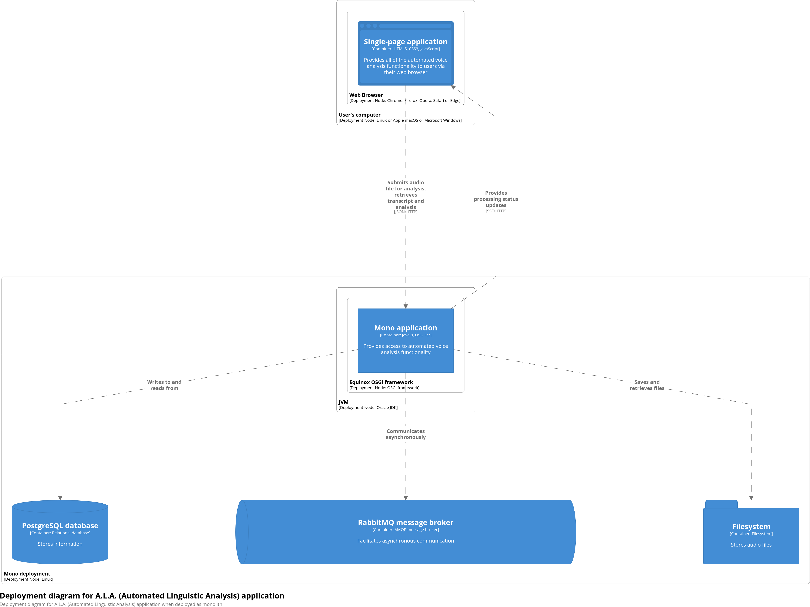
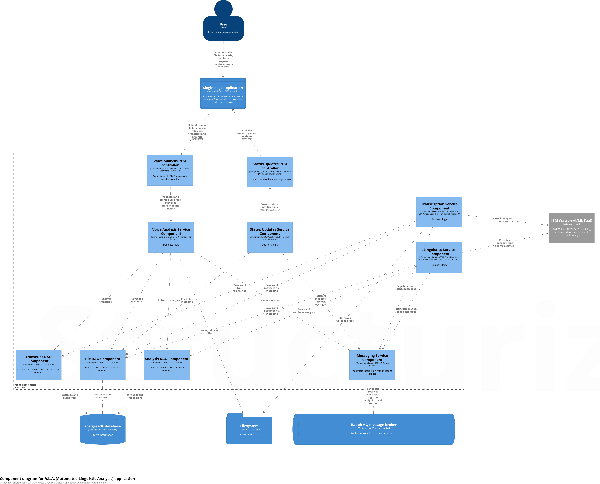
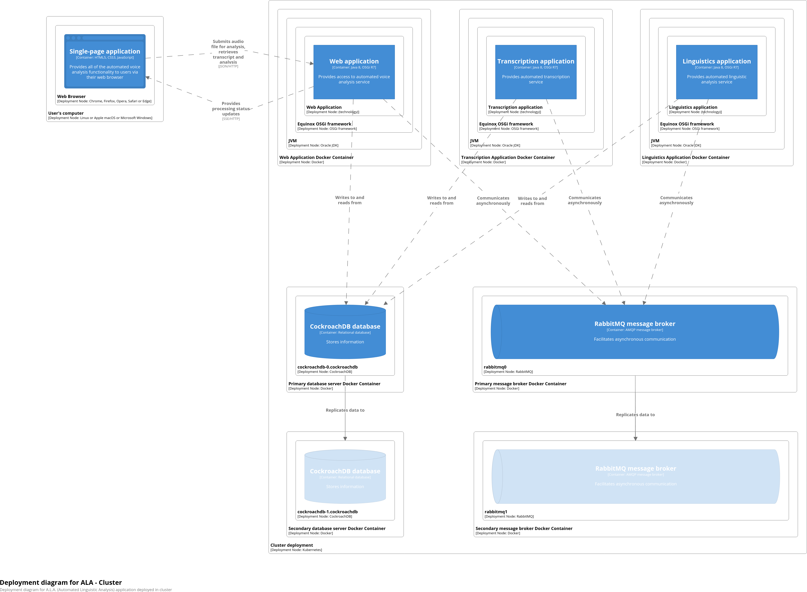
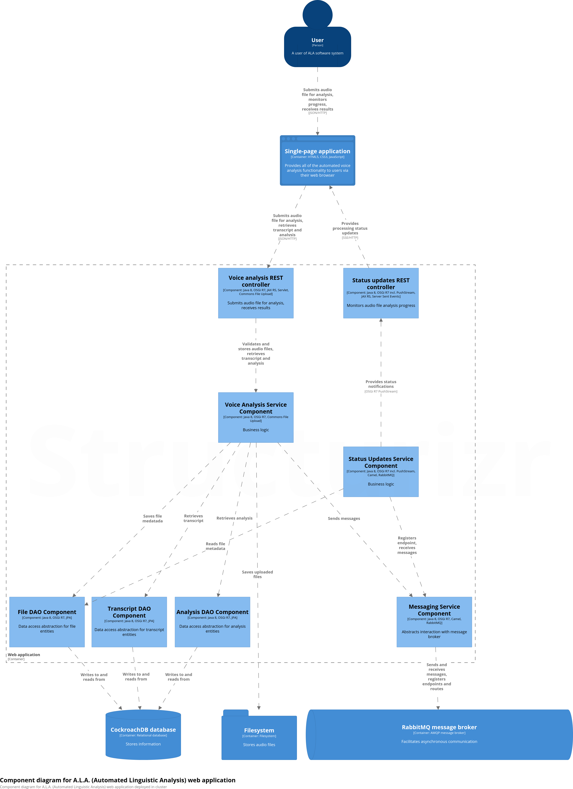
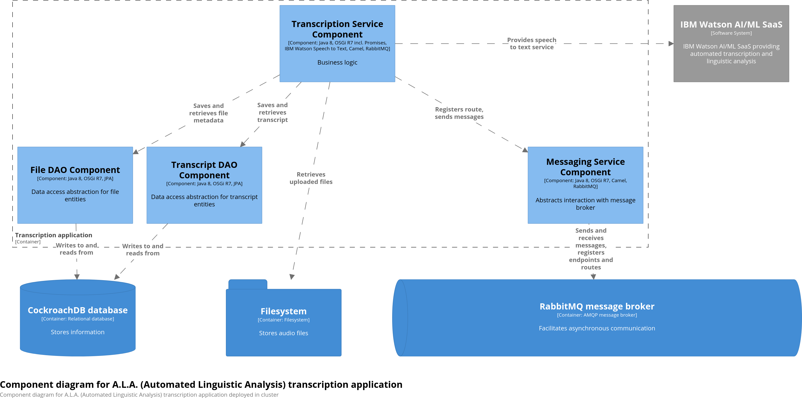
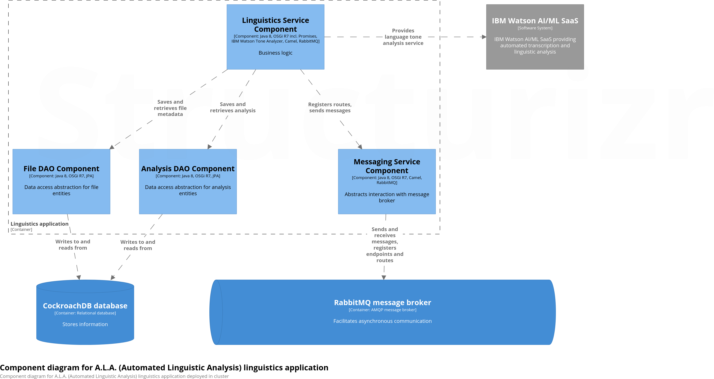

# A.L.A. (Automated Linguistic Analysis) application

Sample application showcasing usage of technologies such as: 

 * **OSGi R7 Promises** for asynchronous generation of transcriptions and linguistic analyses
 * **OSGi R7 Push Stream** and **JAX RS Server Sent Events** for push notifications of processing status
 * **Apache Camel 2.23.1** and **RabbitMQ 3.7** for asynchronous communication between services
 * **JPA 2.1** and **Hibernate 5.2.12**, along with **OSGi R7 JPA** and **Transaction Control** services, for persistence layer
 * **OSGi R7 HTTP** and **JAX RS Whiteboard** for registering servlets, resources and REST controllers
 * **OSGi R7 Configurator**, **Configuration Admin** and **Metatype** services for automatic configuration of components
 * **OSGi R7 Declarative Services** for dependency injection
 * Maven automated build of **Docker** images
 * Maven automated deployment into **Kubernetes** cluster
 * **RabbitMQ** message broker as a **StatefulSet**
 * **CockroachDB** relational database as a **StatefulSet**

For detailed overview, please see the following articles: 

 * [Using Camel and RabbitMQ in an OSGi R7 application, including custom message types](https://ideas.into.software/engineering/2019/04/28/osgi-r7-camel-rabbitmq-custom-message-types.html)
 * [Implementing asynchronous processing with OSGi R7 Promises](https://ideas.into.software/engineering/2019/04/28/osgi-r7-promises-asynchronous-processing.html)
 * [Implementing efficient monitoring of long running operations with OSGi R7 Push Stream and Server Sent Events](https://ideas.into.software/engineering/2019/04/28/osgi-r7-push-stream-server-sent-events.html)
 * [OSGi R7 HTTP Whiteboard, JAX-RS Whiteboard and Converter services applied](https://ideas.into.software/engineering/2019/04/28/osgi-r7-http-jaxrs-whiteboard-converter.html)
 * [Painless Monolith breakup or how automation and efficient design enables smooth transitions](https://ideas.into.software/engineering/2019/04/28/osgi-r7-docker-automation.html)
 * [Automating Kubernetes deployments](https://ideas.into.software/engineering/2019/04/28/osgi-r7-kubernetes-automation.html)

## Configuring
I. **Mono version**
 
1\. Set up **PostgreSQL** database

   - Create database and user using **PostgreSQL** command line or GUI
 
   - If not already installed, install the `postgresql-contrib` package as that’s what’s required to use the `gen_random_uuid()` function; same function is available out-of-the-box on **CockroachDB** which is used for **Kubernetes** version
 
              
2\. Set up **RabbitMQ** message broker
    
   - (_optional_) Set up **RabbitMQ** Web Management console – once set up it will be accessible via [http://localhost:15672/](http://localhost:15672/) (u/p: guest/guest)
     
     `rabbitmq-plugins enable rabbitmq_management`
   
             
3\. Open `configuration.json` file residing in `mono-app` module in `src/main/resources/OSGI-INF/configurator` directory
     
   - Under `org.apache.aries.tx.control.jpa.xa~ala` PID, configure database, user name and password
   - (_optional_) Under `software.into.ala.service.messaging` PID, configure message broker host and port or leave as is to use defaults
   - Under `org.apache.aries.jax.rs.whiteboard.default` PID, configure file storage location – this must match file storage location seen in `software.into.ala.service.transcription` PID
   - Under `software.into.ala.service.transcription` PID, configure **IBM Watson Speech to Text** endpoint and API key – small footprint instances are free and sufficient to test drive this application; for more information see [https://www.ibm.com/watson/services/speech-to-text/](https://www.ibm.com/watson/services/speech-to-text/)
   - Under `software.into.ala.service.linguistics` PID, configure **IBM Watson Tone Analyzer** endpoint and API key – small footprint instances are free and sufficient to test drive this application; for more information see [https://www.ibm.com/watson/services/tone-analyzer/](https://www.ibm.com/watson/services/tone-analyzer/)
    
    
II. **Kubernetes version**
        
1\. Web application (`k8-web-app` module) – **no configuration is necessary**, unless you wish to use custom settings, i.e. 
    
  - Open `configuration.json` file residing in `k8-web-app` module in `src/main/resources/OSGI-INF/configurator` directory
  - Unless you wish to use different settings, DO NOT modify configuration for `org.apache.aries.tx.control.jpa.xa~ala` PID – in **Kubernetes** version, both user and database are created automatically during cluster initialization, which also happens automatically during deployment
  - Unless you wish to use different settings, DO NOT modify configuration for `software.into.ala.service.messaging` PID
  - Unless you wish to use different settings, DO NOT modify configuration for `org.apache.aries.jax.rs.whiteboard.default` PID, e.g. file storage location
    
    
2\. Transcription application (`k8-transcription-app` module) – only **IBM Watson** configuration is required, i.e.

  - Open `configuration.json` file residing in `k8-transcription-app` module in `src/main/resources/OSGI-INF/configurator` directory
  - Under `software.into.ala.service.transcription` PID, configure **IBM Watson Speech to Text** endpoint and API key – small footprint instances are free and sufficient to test drive this application; for more information see [https://www.ibm.com/watson/services/speech-to-text/](https://www.ibm.com/watson/services/speech-to-text/)
        

3\. Linguistics application (`k8-linguistics-app` module) – only **IBM Watson** configuration is required, i.e.

  - Open `configuration.json` file residing in `k8-linguistics-app` module in `src/main/resources/OSGI-INF/configurator` directory
  - Under `software.into.ala.service.linguistics` PID, configure **IBM Watson Tone Analyzer** endpoint and API key – small footprint instances are free and sufficient to test drive this application; for more information see [https://www.ibm.com/watson/services/tone-analyzer/](https://www.ibm.com/watson/services/tone-analyzer/)
        
4\. In main project POM 

  - Modify the `docker-registry` property to use external **Docker** registry or set up a local **Docker** registry; for more information see [https://docs.docker.com/registry/deploying/](https://docs.docker.com/registry/deploying/)
  - If not using local **Docker** registry, remove the `k8-maven.insecureRegistry` property – this one is used for **minikube** automation and required if using local **Docker** registry
  - (optional) Adjust the `k8-maven.memory` and `k8-maven.cpus` properties as needed – this is used for **minikube** automation
        
5\. Set up and start **Kubernetes** cluster – e.g. **minikube** can be used to quickly set up local **Kubernetes** cluster; for more information see [https://github.com/kubernetes/minikube](https://github.com/kubernetes/minikube)
        
        
6\. (optional) Customize **Kubernetes** descriptors for deploying cluster versions of **RabbitMQ** and **CockroachDB** as **StatefulSets**  – these reside in `k8-infra` project, in `src/main/k8` directory; for more information see: 

  - [“Deploy RabbitMQ on Kubernetes with the Kubernetes Peer Discovery Plugin”](https://github.com/rabbitmq/rabbitmq-peer-discovery-k8s/tree/master/examples/k8s_statefulsets)
  - [“CockroachDB on Kubernetes as a StatefulSet”](https://github.com/cockroachdb/cockroach/tree/fcc1637698fd0ec91c181bd096f963d35a16e4e8/cloud/kubernetes)

## Building
    
I. **Mono version**

    mvn install

  
II. **Kubernetes version**
       
Build project and **Docker** images, automatically pushing **Docker** images to configured repository

    mvn -P k8 install

## Deploying

I. **Mono version**

 1\. Go to `mono-app` module directory and run
 
    java -jar target/mono-app.jar
        
 2\. Open [http://localhost:8080/spa/index.html](http://localhost:8080/spa/index.html) in web browser

II. **Kubernetes version**
        
 1\. To deploy onto **Kubernetes** cluster from main project directory, run

    mvn -P k8 deploy
        
 2\. Find IP and service port of `ala-k8-web-app` service – e.g. for **minikube** you can use 
 
    minikube service --url ala-k8-web-app
        
 
 3\. Open [http://IP:SERVICEPORT/spa/index.html](http://IP:SERVICEPORT/spa/index.html) in web browser

## Architecture 

I. **Mono version**
        
1\. Deployment view
     
 
 
        
2\. Component view
 
 

II. **Kubernetes version**

1\. Deployment view 
   
 

        

2\. Component view
 
 - Web application
    
  

           
 - Transcription application
 
  

 
 - Linguistics application

 
 
   
        
## Technology stack
* Java 8 

* OSGi Release 7 Core and Enterprise specifications implementations, including
    * OSGi Configurator
    * OSGi Metatype Service
    * OSGi Configuration Admin Service
    * OSGi DTO
    * OSGi Declarative Services
    * OSGi Converter
    * OSGi JPA Service
    * OSGi HTTP Whiteboard
    * OSGi JAX-RS Whiteboard
    * OSGi Transaction Control Service
    * OSGi Push Stream
    * OSGi Promises

* Equinox OSGi container 3.13.100
* JPA API 2.1
* Hibernate 5.2.12
* Apache Camel 2.23.1, including Camel RabbitMQ component
* Apache Felix Http Jetty 4.0.6
* IBM Watson SDK 6.14.2, including Speech to Text and Tone Analyzer
* Message broker:
    * Mono deployment: RabbitMQ 3.6.16
    * Kubernetes deployment: RabbitMQ 3.7
* Relational database: 
    * Mono deployment: PostgreSQL 10.7
    * Kubernetes deployment: CockroachDB 2.1.6
